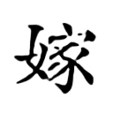

# Generating handwritten Chinese characters using CycleGAN

We use CycleGAN to generate handwritten Chinese characters.

## LANTING


## BAOTA




# Pytorch-CycleGAN
A clean and readable Pytorch implementation of CycleGAN (https://arxiv.org/abs/1703.10593)

## Prerequisites
Code is intended to work with ```Python 3.6.x```, it hasn't been tested with previous versions

### [PyTorch & torchvision](http://pytorch.org/)
Follow the instructions in [pytorch.org](http://pytorch.org) for your current setup

### [Visdom](https://github.com/facebookresearch/visdom)
To plot loss graphs and draw images in a nice web browser view
```
pip3 install visdom
```

## Training

### 1. Setup the dataset
First, you will need to download and setup a dataset. The easiest way is to use one of the already existing datasets on UC Berkeley's repository:
```
./download_dataset <dataset_name>
```
Valid <dataset_name> are: apple2orange, summer2winter_yosemite, horse2zebra, monet2photo, cezanne2photo, ukiyoe2photo, vangogh2photo, maps, cityscapes, facades, iphone2dslr_flower, ae_photos

Alternatively you can build your own dataset by setting up the following directory structure:

    .
    ├── datasets                   
    |   ├── <dataset_name>         # i.e. brucewayne2batman
    |   |   ├── train              # Training
    |   |   |   ├── A              # Contains domain A images (i.e. Bruce Wayne)
    |   |   |   └── B              # Contains domain B images (i.e. Batman)
    |   |   └── test               # Testing
    |   |   |   ├── A              # Contains domain A images (i.e. Bruce Wayne)
    |   |   |   └── B              # Contains domain B images (i.e. Batman)
    
### 2. Train!
If you don't own a GPU remove the --cuda option, although I advise you to get one!
If you have multi-GPU, you need to add device_id in `./train.py`.
```python
train.py
    line 56 - 59: 
        netG_A2B = nn.DataParallel(netG_A2B, device_ids=[0])
        netG_B2A = nn.DataParallel(netG_B2A, device_ids=[0])
        netD_A = nn.DataParallel(netD_A, device_ids=[0])
        netD_B = nn.DataParallel(netD_B, device_ids=[0])
```
```python
python3 train.py --cuda --dataroot datasets/lantingkai/ --input_nc 1 --output_nc 1
```

```python
python3 train.py --cuda --dataroot datasets/baotakai/ --input_nc 1 --output_nc 1
```

```
./train --dataroot datasets/<dataset_name>/ --cuda
```
This command will start a training session using the images under the *dataroot/train* directory with the hyperparameters that showed best results according to CycleGAN authors. You are free to change those hyperparameters, see ```./train.py --help``` for a description of those.

Both generators and discriminators weights will be saved under the output directory.

You can also view the training progress as well as live output images by running ```python3 -m visdom``` in another terminal and opening [http://localhost:8097/](http://localhost:8097/) in your favourite web browser. This should generate training loss progress as shown below (default params, horse2zebra dataset):

 


## Test
```python
python3 test.py --dataroot datasets/lantingkai/ --cuda --input_nc 1 --output_nc 1
```

```python
python3 test.py --dataroot datasets/baotakai/ --cuda --input_nc 1 --output_nc 1
```

```
./test --dataroot datasets/<dataset_name>/ --cuda
```
This command will take the images under the *dataroot/test* directory, run them through the generators and save the output under the *output/A* and *output/B* directories. As with train, some parameters like the weights to load, can be tweaked, see ```./test.py --help``` for more information.

Examples of the generated outputs (default params, horse2zebra dataset):

 <br>


## License
This project is licensed under the GPL v3 License - see the [LICENSE.md](LICENSE.md) file for details

## Acknowledgments
Code is basically a cleaner and less obscured implementation of [pytorch-CycleGAN-and-pix2pix](https://github.com/junyanz/pytorch-CycleGAN-and-pix2pix). All credit goes to the authors of [CycleGAN](https://arxiv.org/abs/1703.10593), Zhu, Jun-Yan and Park, Taesung and Isola, Phillip and Efros, Alexei A.
