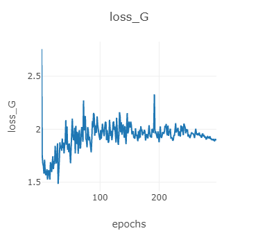
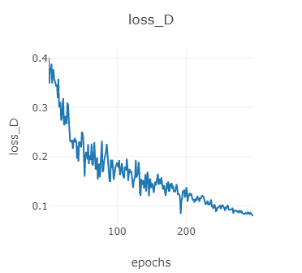
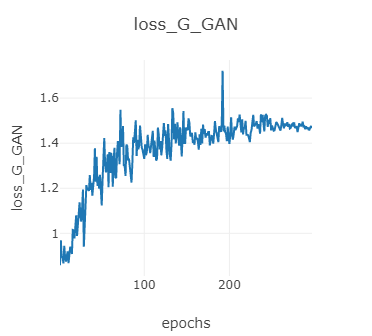
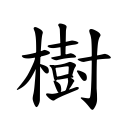
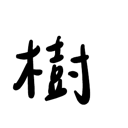

# Generating handwritten Chinese characters using CycleGAN

We use CycleGAN to generate handwritten Chinese characters.
## How to Use
```
pip3 install pywebio
python3 demo.py
```
Then you can open [http://localhost:8080/](http://localhost:8080/) in your web browser to transform text to your own handwritten. We have four different handwritten styles and paper textures.


## Fake Handwritten from an Random Article (桃花源記)

# Data Preprocessing
## Prerequisites
```
sudo apt-get install poppler-utils
pip install pdf2image
```
In ```buffer/article_text``` and ```buffer/article_pdf```, prepare your labeling article(.txt) and own handwritten(.pdf) in the directory, respectively.
## Start Generate Train dataset
Change arguments to create directory and test datasets.
```
python3 dataPreprocess.py --dirName test --test 1
```

# Pytorch-CycleGAN Training
A clean and readable Pytorch implementation of CycleGAN (https://arxiv.org/abs/1703.10593)

## Prerequisites
Code is intended to work with ```Python 3.6.x```, it hasn't been tested with previous versions

### [PyTorch & torchvision](http://pytorch.org/)
Follow the instructions in [pytorch.org](http://pytorch.org) for your current setup

### [Visdom](https://github.com/facebookresearch/visdom)
To plot loss graphs and draw images in a nice web browser view
```
pip3 install visdom
```

## Training

### 1. Setup the dataset
First, you will need to prepare your text image and handwritten image. Or you can unzip the datasets.zip in ./datasets.
Build your own dataset by setting up the following directory structure:

    .
    ├── datasets                   
    |   ├── <dataset_name>         # i.e. text2handwritten
    |   |   ├── train              # Training
    |   |   |   ├── A              # Contains domain A images (i.e. real text)
    |   |   |   └── B              # Contains domain B images (i.e. self handwritten)
    |   |   └── test               # Testing
    |   |   |   ├── A              # Contains domain A images (i.e. real text)
    |   |   |   └── B              # Contains domain B images (i.e. self handwritten)
    
### 2. Train!
If you don't own a GPU remove the --cuda option, although I advise you to get one!
If you have multi-GPU, you need to add device_id in `./train.py`.
```python
train.py
    line 56 - 59: 
        netG_A2B = nn.DataParallel(netG_A2B, device_ids=[0])
        netG_B2A = nn.DataParallel(netG_B2A, device_ids=[0])
        netD_A = nn.DataParallel(netD_A, device_ids=[0])
        netD_B = nn.DataParallel(netD_B, device_ids=[0])
```
```python
python3 train.py --cuda --dataroot datasets/claire2_128/ --input_nc 1 --output_nc 1
```

```
./train.py --dataroot datasets/<dataset_name>/ --cuda
```
This command will start a training session using the images under the *dataroot/train* directory with the hyperparameters that showed best results according to CycleGAN authors. You are free to change those hyperparameters, see ```./train.py --help``` for a description of those.

Both generators and discriminators weights will be saved under the output directory.

If you meet connection problems, you can try start visdom.server. View the training progress as well as live output images by running ```python3 -m visdom``` in another terminal and opening [http://localhost:8097/](http://localhost:8097/) in your favourite web browser. This should generate training loss progress as shown below (default params, horse2zebra dataset):

  <br>



## Test
```python
python3 test.py --dataroot datasets/test/ --cuda --input_nc 1 --output_nc 1
```
```
./test.py --dataroot datasets/<dataset_name>/ --cuda
```
This command will take the images under the *dataroot/test* directory, run them through the generators and save the output under the *output/A* and *output/B* directories. As with train, some parameters like the weights to load, can be tweaked, see ```./test.py --help``` for more information.

Examples of the generated outputs (real text, fake handwritten):

 
real handwritten
fake handwritten

## License
This project is licensed under the GPL v3 License - see the [LICENSE.md](LICENSE.md) file for details

## Acknowledgments
Code is basically a cleaner and less obscured implementation of [pytorch-CycleGAN-and-pix2pix](https://github.com/junyanz/pytorch-CycleGAN-and-pix2pix). All credit goes to the authors of [CycleGAN](https://arxiv.org/abs/1703.10593), Zhu, Jun-Yan and Park, Taesung and Isola, Phillip and Efros, Alexei A.